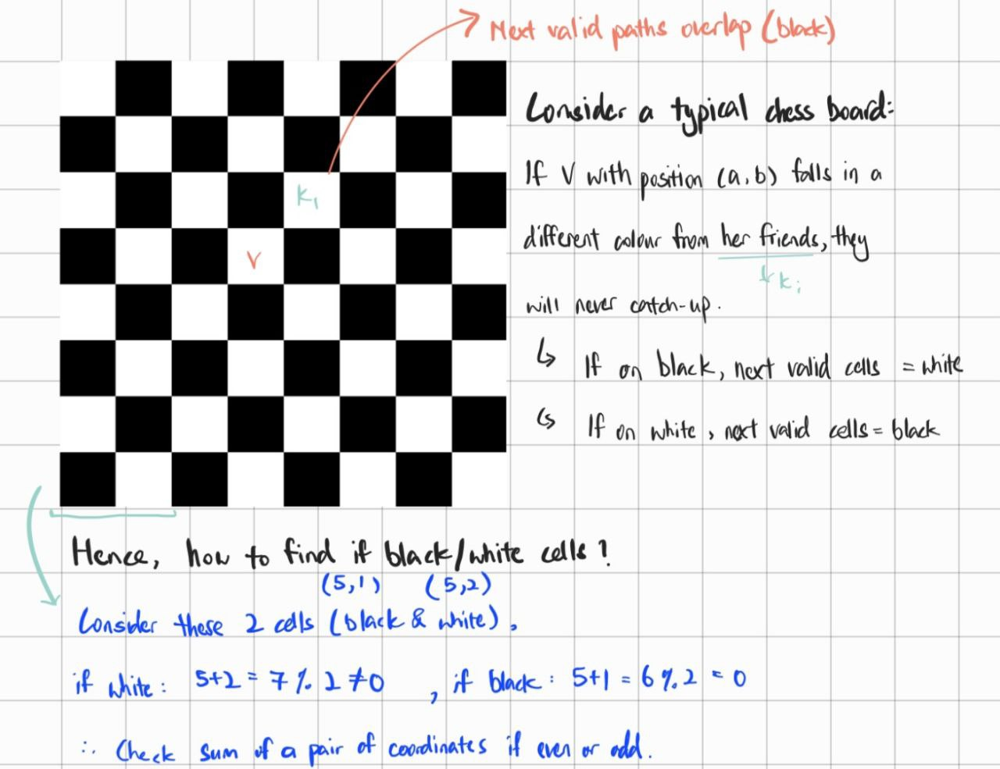

# Codeforces Stuff

My attempts at some Codeforces problems. If you'd like to see some of my thought process (Warning! It's super messy), click [here](./thoughts.md).

## Compilation

```bash
g++ -std=c++11 -O2 -Wall -pedantic -Wconversion -Wshift-overflow=2 -Wduplicated-cond -D_GLIBCXX_DEBUG -D_GLIBCXX_DEBUG_PEDANTIC -D_FORTIFY_SOURCE=2 -fsanitize=address 1999C.cpp -o build/1999C
```

[Catching silly mistakes with GCC](https://codeforces.com/blog/entry/15547)

## Debugging

A debugging template made by Anshul_Johri has been added to this repo to ease debugging efforts, links to [GitHub](https://github.com/Anshul-Johri-1/Debug-Template) repo and [Codeforces Blog](https://codeforces.com/blog/entry/125435).

To use the template, include `debug.h` in solution and use `debug(var1, var2, ...)` to print out values of variables with different types, works with all types including primitives, derived, and user-defined.

For user-defined data types, a function named `print(SomeStruct s)` is required before using `debug`:

```cpp
struct Point
{
    int x{};
    int y{};
};
void print(Point ob)
{
    cerr << "(" << ob.x << "," << ob.y << ")";
}

// debug(ob);
```

For arrays decayed into pointers, use `debugArr(arr, n)` where n is size of array. A decayed array occurs when an array is passed to a function in which the array will then be converted to a pointer to the first element of the array.

> [!TIP]
> `debug()` statements do not need to be removed during submission to Codeforces, thanks to the `ONLINE_JUDGE` macro which will ignore all debug statements.

Ensure the following is included in the solution file, which will allow Codeforces to ignore debug statements and imports.

```cpp
#ifndef ONLINE_JUDGE
#include "template.cpp"
#else
#define debug(...)
#define debugArr(...)
#endif
```

## Tip and Tricks

This section contains various tips and tricks to speed up coding when attempting contests.

1. To insert items into a vector, instead of:

```cpp
for (size_t i = 0, i < nums.size(), i++) {
  int x;
  cin >> x;
  nums.push_back(x);
}
```

Why not?

```cpp
for (auto &i : nums) {
  cin >> &i;
}
```

2. DO NOT use `size_t` for reverse iteration. By subtracting `size_t` to traverse a vector in the reverse order, when `size_t` is subtracted to below 0, it will underflow and produce an extremely large number as `size_t` is unsigned:

```cpp
string s;
cin >> s;

for (size_t i = s.size() - 1; i >= 0; i--) { // underflow when s.size = 0
  // ...
}

```

3. Specify the appropriate input format for `std` functions like `accumulate(nums.begin(), nums.end(), 0LL)` for a vector array with long long variable type.

## Solutions

### Domino Piling

<div>
  
</div>

Draw to better visualize. Just `n * m / 2` , where 2 is the domino of size 2 x 1. If use int in C++, will round up/down or just floor() in Python to take whole num instead of float which provides the num of dominos that can perfectly fit the M x N matrix excluding the remainder.

### Hit the Lottery

Input size is 1≤n≤10^9 means that cannot use DP due to space complexity of o(n) to create an array of size n will lead to memory overflow when n = 10^9. Since nominal value of bills is constant and can be divided from one another in sequence, can use Greedy to always pick the bill with the greatest nominal value in sequence while eliminating the need for array.

This problem is similar to Coin Change, but coin change must use DP as Greedy does not always guarantee the most optimal solution.

### Young Physicist

Consider vectors a (aX, aY, aZ) and b (bX, bY, bZ), a + b = (aX+bX, aY+bY, aZ+bZ).

### Effective Approach

Instead of following the problem statement to perform linear search, use hashmap instead to allow O(1) lookup of values. Linear search is O(n) and since upper bound for n and m is 1e5, may need to perform 1e10 operations leading to a TLE verdict. For reverse search used by Petya, just take difference of n (length of array) and index of b (target) with the formula, $p=\left| i_{b}-n \right| + 1$.

Hence, no need to perform linear search for every $b_{i}$ in m array with worst case O(n) as need to populate hashmap.

### 102B: Sum of Digits

Take note that the input $n$ upper limit is $10^{100000}\gt 2^{63}-1 \text{ (the limit of long long)}$. Hence, take the input as string and loop through it to obtain individual digits as chars. Since, ASCII digits start from 48 or `'0'`, convert char to int using `int i = '1' - '0';` or `int i = (int)'1' - 48;`. Then, sum up the individual digits. The summation process is to be repeated until the sum contains only one digit.

### 579A: Raising Bacteria

Everday, each bacterium split into 2, so go by 2 to the power of n-th day, $2^{n}$. Since the question only requires the least number of bacteria possible, the number of days taken can be ignored. As a result, if x is a valid value for $2^{n}$ will only need 1 bacteria and it will eventually reach exactly x bacteria. This is valid for values such as $2^{3}$ = x = 8, and $2^{6}$ = x = 64 where only 1 bacteria is needed to be inserted on the first day.

Otherwise, some bacteria will need to be manually inserted at some point in time. For instance, x = 5, bacteria needs to be inserted twice on the first and last day (third day). If you lay out the values like so, 101, it is conincidentally the binary representation of the integer, 5 which contains 2 set bits. Likewise, the binary representation for all $2^{n}$ values only contain 1 set bit. Hence, the answer for a x value may be derived by simply counting the number of set bits.

Bit Tricks:
https://graphics.stanford.edu/~seander/bithacks.html#CountBitsSetNaive

### 2000C: Numeric String Template

The implementation is quite trivial since it involves only `std::map` for the solution. However, I overlooked the method of passing std containers to another function, resulting in a TLE verdict.

Originally, I passed both the `std::vector` and `std::string` by value, meaning copies of the original containers will be created which is a linear time operation. It was this exact bug resulted in a TLE, and I simply did not think of it during my debugging efforts.

Time complexity analysis: $O(n\ log\ n)$, where `n = nums.size()`

`std::map` methods such as access, insert, and count are of logarithmic complexity, $O(log\ n)$. By linearly traversing the `nums` array for `std::map` to `count()` and `insert` elements, the time complexity of `solve()` will be worst case, $O(n\ log\ n)$, despite the addition of a $O(n)$ for loop.

In the above scenario, $O(n)$ in $O(n) + O(n\ log\ n)$ will be ignored as for larger values for $n$, $O(n)$ will matter less. Plot $x$, $x\ log\ x$ and $x + x\ log\ x$ in Desmos and the difference is apparent at extreme values. Also, see [here](https://www.reddit.com/r/learnprogramming/comments/12iafl9/comment/jfsw5cl/?utm_source=share&utm_medium=web3x&utm_name=web3xcss&utm_term=1&utm_content=share_button) for more info.

However, if passing by value is used for `vector<int> nums` and `string s` in `solve()`, it will result in $O(n) + O(n\ log\ n)$. This is due to the linear traversal of `nums` and `s` to create copies to pass to `solve()`. Also, since `solve()` is called `m` times for each test case, the actual time complexity is $O(n\times m) + O(m\times n\ log\ n)$. In a worst-case scenario where `n = m` as they have the same upper bounds, the complexity might be $O(n^2) + O(n^2\ log\ n)$. Hence, it's best to pass by reference for large arrays.

### 1848A: Vika and Her Friends

This problem is quite tricky for a Div 2A. The problem description is written in such a way that is simply, hard to understand, which further complicates everything. Nevertheless, the actual solution for the problem is very short and sweet.

<div>
  
</div>

The `n * m` grid can be represented as a black and white chessboard with `n` rows and `m` columns. This will help immensely in understanding and solving the problem as seen above. The solution basically involves checking whether Vicky and any one of her friends are located within cells of the same color. If so, they will eventually meet. Otherwise, they will not. Refer to [this](https://cloud.tencent.com/developer/article/2320697) article or [a more lengthy one](https://blog.zhenbo.pro/codeforces-885a-vika-and-her-friends-1848a-solution/) for more explanation.

### 2169B: Drifting Away

Got screwed over by this problem, but the solution is surprisingly, very simple. At first, my solution involves pushing symbols to the stack and make sure they look for infinite matches like `><`, `>*<`, and `<*<`. For the last combination, the correct solution is to simply replace `*` with `>` or vice versa if it's `>*>` to achieve `><` which causes Monocarp to row infinitely. Hence, a simple condition is more than enough to ensure the input string is clear of such infinite combinations:
```cpp
if ((s[i] != '<') && (s[i + 1] != '>')) {
  cout << -1 << '\n';
  break;
}
```

Substrings that don't satisfy the above conditions are `><`, `*<` (can be turned into `><`), `>*` (can be turned into `><`) and lastly, `**` (can also be turned into `><`). `<>`, will never result in infinite drift, so just take the max count of `<`, or `>`, whichever appears more frequent and sum it up with count of `*`. Alternatively, just `s.size() - min(count(s.begin(), s.end(), '<'), count(s.begin(), s.end(), '>'))`.

## 1609A: Divide and Multiply 

Pick even numbers and count how many times they can be divided by 2 until they are eventually odd, i.e. 8 / 2 = 4, 4 / 2 = 2, 2 / 2 = 1, so this counts as 3 divisions. Notice that for each divide by 2 operation, the largest element is also multiplied by 2. Hence, when all the array has no even elements left except the largest element (which is definitely odd in this case), just multiply the largest element by $$2^{k}$$ where `k = counts of division by 2`, and return the sum of the whole array as answer.

## Useful Resources

Great books:

- [Competitive Programmer’s Handbook, Antti Laaksonen](https://cses.fi/book/book.pdf)
- [Competitive Programming 3 - Book 1, Steven Halim & Felix Halim](https://www.comp.nus.edu.sg/~stevenha/myteaching/competitive_programming/cp1.pdf)
