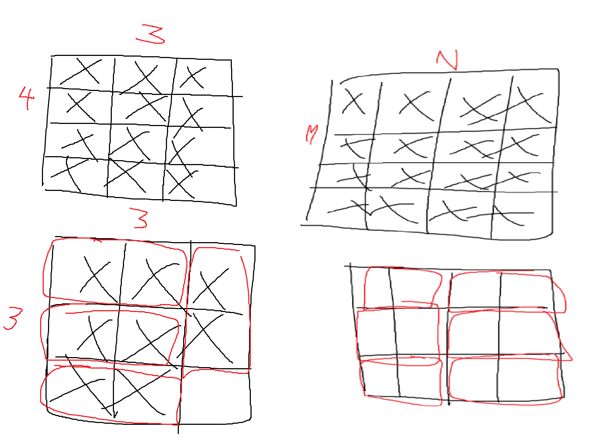

# Codeforces Stuff

My attempts at some Codeforces problems. 

## Solutions

### Domino Piling

  

Draw to better visualize. Just `n * m / 2` , where 2 is the domino of size 2 x 1. If use int in C++, will round up/down or just floor() in Python to take whole num instead of float which provides the num of dominos that can perfectly fit the M x N matrix excluding the remainder.

### Hit the Lottery

Input size is 1≤n≤10^9 means that cannot use DP due to space complexity of o(n) to create an array of size n will lead to memory overflow when n = 10^9. Since nominal value of bills is constant and can be divided from one another in sequence, can use Greedy to always pick the bill with the greatest nominal value in sequence while eliminating the need for array.

This problem is similar to Coin Change, but coin change must use DP as Greedy does not always guarantee the most optimal solution.

## Useful Resources

Great books:
- [Competitive Programmer’s Handbook, Antti Laaksonen](https://cses.fi/book/book.pdf)
- [Competitive Programming 3 - Book 1, Steven Halim & Felix Halim](https://www.comp.nus.edu.sg/~stevenha/myteaching/competitive_programming/cp1.pdf)
